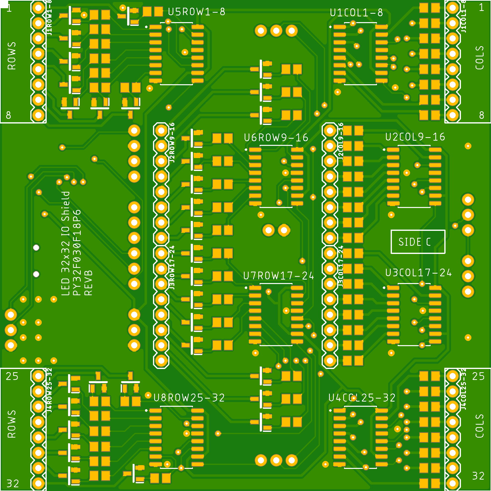
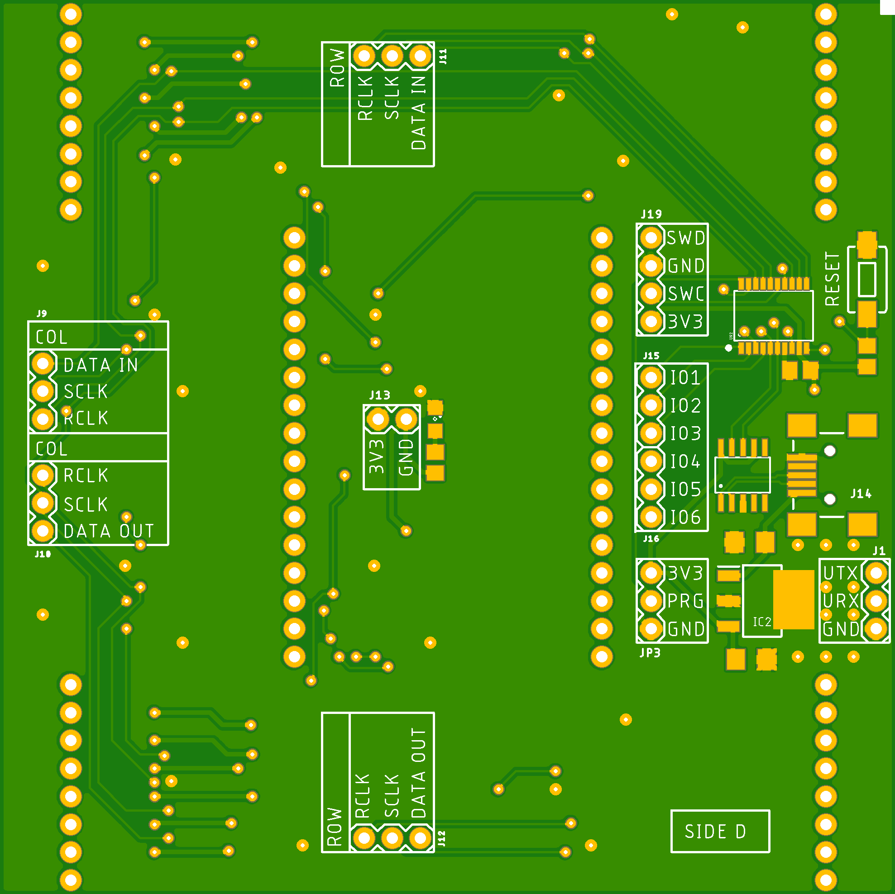

# ledpanel
32x32 LED panel

Using 16 8x8 1.9mm LED modules to make a larger 32x32 8cm panel.
Adding shift registers and a small py32 microcontroller to multiplex the display.
The panel is broken out into two boards, the first a simple breakout and the
second is a plugin board that holds the mcu and shift registers. The panel
design does not overhang any edges so multiple panels can be connected together.

